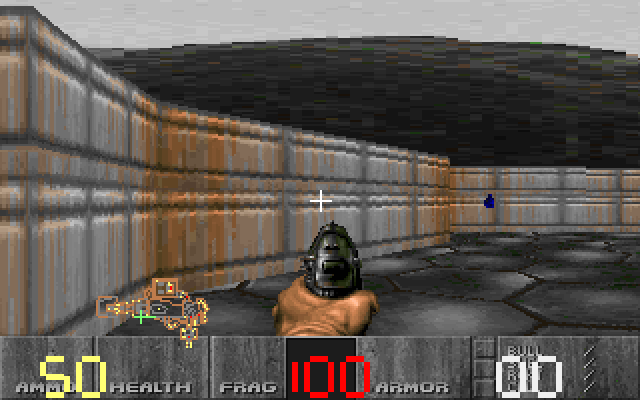
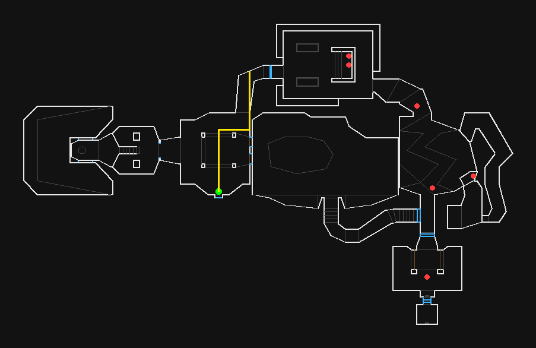

# BFDoom

Doom compiled to Brainfuck, with a WAD-backed playable host path for testing the port.





## Status

BFDoom is a real porting workbench, not a clean-room Doom clone. The repo contains a DoomGeneric source tree compiled through ELVM into Brainfuck, plus a patched Brainfuck host runner that keeps startup usable while more of the original Doom runtime is ported across.

Current verified path:

- generated Brainfuck artifact: `programs/bfdoom-linked.bf.gz`
- Doom shareware IWAD archive: `data/doom1.wad.gz`
- WAD-backed E1M1 geometry, flats, wall textures, sky, sprites, weapon view, status bar, HUD, pickups, enemies, basic combat, doors, exits, and map advancement
- repeat startup through a saved VM snapshot, usually reaching the first playable frame in a few seconds on this Windows/WSL setup

This is not a 1:1 replacement for Chocolate Doom or the original executable yet. Menus, sound, full renderer parity, complete monster AI, and several source state-machine details are still being closed.

## Requirements

- Node.js 20+
- Windows with WSL, or a Linux shell with `bash`
- `make`, `g++`, `gzip`, and standard build tools inside WSL/Linux

On Ubuntu/WSL:

```bash
sudo apt update
sudo apt install -y build-essential make gzip
```

## Play

```bash
npm run play:bfdoom
```

The first run restores `programs/bfdoom-linked.bf` from the compressed artifact if needed, restores `data/DOOM1.WAD` from `data/doom1.wad.gz` if needed, builds the optimized Brainfuck host runner, and starts the playable path.

Controls:

- `W` / `S` or Up / Down: move
- `A` / `D` or Left / Right: turn
- `Space` / `F`: fire
- `1`-`7`: switch owned weapons
- `E`: use
- `Q` / `Esc`: quit

## Verify

```bash
npm run test:bfdoom-host
npm test
```

`test:bfdoom-host` verifies the playable WAD-backed path. `npm test` also checks the smaller Brainfuck runner, Doom `m_random` harness, and BFIO WAD-size bridge.

## Rebuild the Brainfuck Artifact

```bash
npm run build:bfdoom-linked
```

That recompiles DoomGeneric through ELVM and writes `programs/bfdoom-linked.bf`. The raw file is intentionally ignored by Git because it is about 550 MB; the compressed artifact is kept for practical installs.

## Notes

- `programs/braindoom.bf` is the older toy terminal demo.
- `programs/bfdoom-linked.bf.gz` is the current generated Brainfuck Doom artifact.
- `docs/brainfuck-doom-port.md` tracks lower-level porting evidence and remaining fidelity work.

## License

Doom and DoomGeneric code in this repo are GPL-2.0. ELVM is MIT licensed. See the vendor license files for upstream details.
