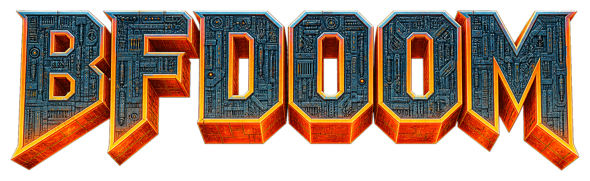
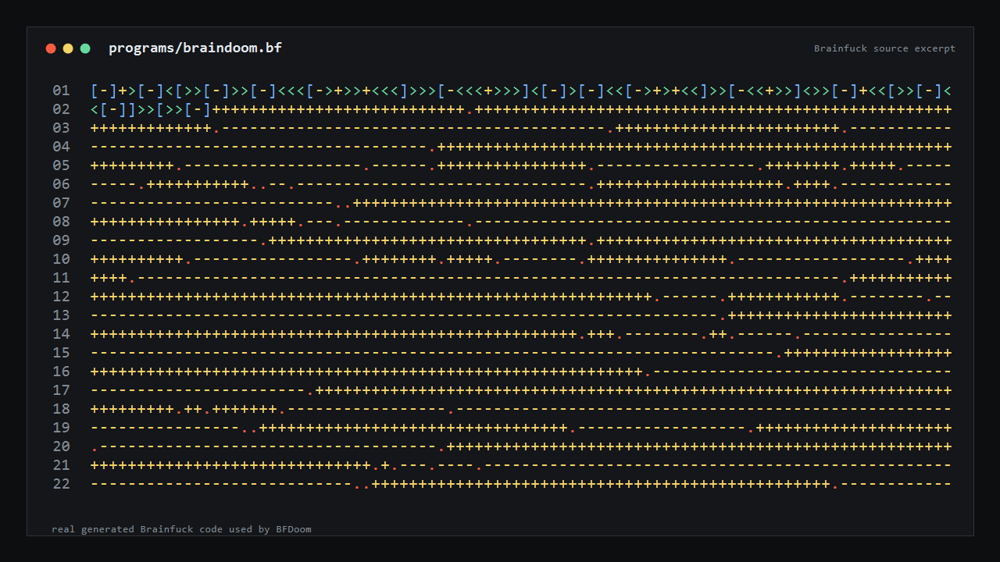

<p align="center">
  
</p>

<h1 align="center">BFDoom</h1>

<p align="center">Doom compiled to Brainfuck and playable in a small desktop window.</p>

<p align="center">
  
</p>

<p align="center">
  
</p>

## Play

```bash
npx @jasperdevs/bfdoom
```

Or install it:

```bash
npm install -g @jasperdevs/bfdoom
bfdoom
```

From a clone:

```bash
git clone https://github.com/jasperdevs/BFDoom.git
cd BFDoom
npm run play:window
```

The main Brainfuck program is `programs/bfdoom-linked.bf.gz`. On first run it expands to `programs/bfdoom-linked.bf`; the raw file is about 518 MB, so only the compressed artifact is committed.

## Controls

| Key | Action |
| --- | --- |
| `W` / `S`, Up / Down | Move |
| `A` / `D`, Left / Right | Turn |
| `Space` / `F` | Fire |
| `E` | Use |
| `Tab` | Automap |
| `1`-`7` | Switch weapons |
| `Esc` | Menu |
| `Q` | Quit |

## Setup

Requires Node.js 20+. On Windows, install WSL. On Linux/WSL, install basic build tools:

```bash
sudo apt update
sudo apt install -y build-essential make gzip
```

## Test

```bash
npm run test:bfdoom-host
npm test
```

## Status

BFDoom is playable and still being brought closer to Doom. The biggest unfinished pieces are sound, menus, and full engine/rendering parity. Technical notes live in [docs/brainfuck-doom-port.md](docs/brainfuck-doom-port.md).

## License

GPL-2.0-only. Doom and DoomGeneric are GPL-2.0; ELVM is MIT. See the vendor license files for upstream details.
